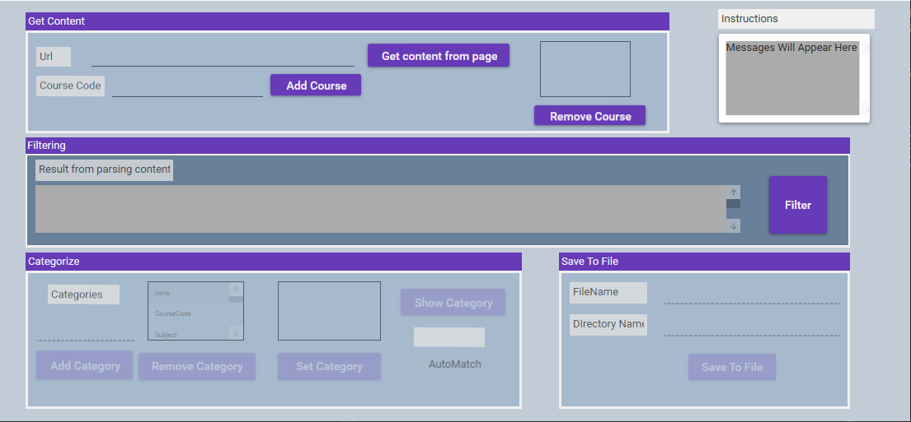

# Timetable-Transfer

This is WPF desktop application developed using C# and Visual Studio. I created this tool to help me transfer the timetable from the my school's website into Google Calendar.

## Notes

* I recommend using Visual Studio 2019 + to open.
* It works by categorizing course information within an html page such as Proffessor Name, Course Code and creating a .csv file which can be imported into Google Calendar.

### Dependencies
This project needs the following packages which could be installed using NuGet Package Manager:
* Unofficial.Microsoft.mshtml
* MaterialDesignThemes

## How to use

1. Run the application
2. Enter the url to the school timetable in the proper field. The url could be a wep page that contains the timetable information or a full path to a html file on the local machine.
3. The application will parse the webpage/file (if it is written as html) and display all contents in a messagebox.
4. Enter the course codes in the proper field.
5. Click the filter button and the application will take the contents and filter to find the details that is relevant based on the course codes.
6. You will now have to categorize the details on the html page given the categories in categories list and tell the program what each piece of data represents. i.e. Professor Name, Course Code, Room, etc. (I plan to later change this part)
7. You categorise by selecting the data in the data list and then selecting the category in the category list then and cliking set category.
8. More categories can be added if there is isn't already part of the list
9. When finished, enter the file name and directory to save the results into and a .csv file will be created in the specified location
10. This .csv can be imported into google calendar following the instructions [here](https://support.google.com/calendar/answer/37118?co=GENIE.Platform%3DDesktop&hl=en)

